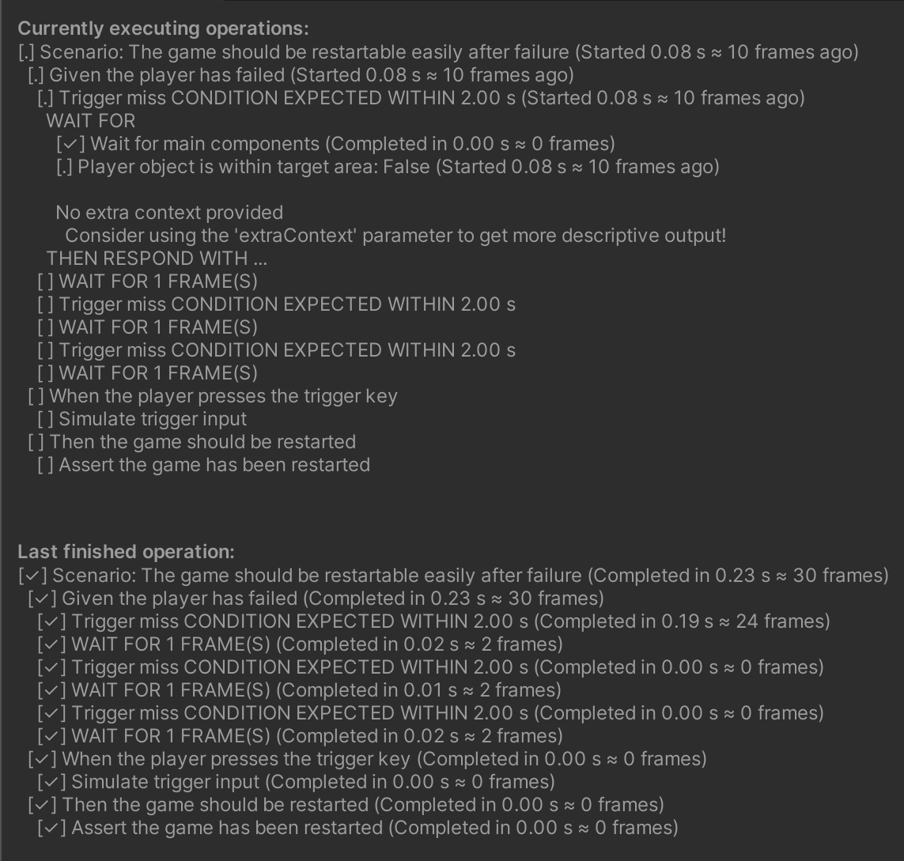

# Responsible in Unity

## Supported Unity versions

Responsible aims to support all current LTS Version:
* 2021, 2022: Fully supported. CI is periodically updated to run on the latest releases,
  but might lag behind a bit. Please report any issues you find.
* No TECH stream releases are tested, but feel free to report issues you find, and they might get fixed.

## Overview

Responsible was originally written for Unity,
and only later ported to .NET standard,
so there are many things already set up for getting started.

To start using Responsible, you'll need to
* install the package,
* reference the `Responsible` assembly from your test assemblies, and
* set up your tests using [`UnityTestInstructionExecutor`](xref:Responsible.Unity.UnityTestInstructionExecutor).

## Installation

[OpenUMP](https://openupm.com/) is the recommended way of installing Responsible in Unity.

### Using OpenUPM

After [setting up OpenUMP](https://openupm.com/docs/),
you can add Responsible to your project by running
```
openupm add com.beatwaves.responsible
```

### Direct Unity Package Manager Reference

Select the version you want to use from
[releases](https://github.com/sbergen/Responsible/releases),
and add the following to `Packages/manifest.json`
```json
"com.beatwaves.responsible": "https://github.com/sbergen/Responsible.git?path=/com.beatwaves.responsible#vX.Y.Z"
```
replacing `X.Y.Z` with the version you want to use.

### Without the Package Manager

If you can't or don't want to use the package manager, you can also directly incorporate
the [com.beatwaves.responsible](https://github.com/sbergen/responsible/tree/main/com.beatwaves.responsible) directory into your project.
This could be done manually, or e.g. with a symlink and git submodule.

## Referencing the Assembly

With either installation option, you'll end up with an assembly called `Responsible`,
with the `UNITY_INCLUDE_TESTS` define constraint.
To use Responsible, simply reference this from your test assemblies.

## Examples

For a simple example of a basic test setup,
there's an [example project](https://github.com/sbergen/responsible/tree/main/com.beatwaves.responsible/Samples~/ResponsibleGame)
with some [basic tests](https://github.com/sbergen/responsible/tree/main/com.beatwaves.responsible/Samples~/ResponsibleGame/PlayModeTests) included.
This sample game can be installed from the Unity Package Manager,
and is also symlinked into the main Unity project in this repository, for convenience.

The library itself also has extensive test coverage,
which may be used as more extensive examples of usage.
Note that these tests live outside of the package,
so that they do not get included into projects referencing Responsible.
(This has to do with undocumented reasons related to using `"type": "tests"` in `package.json`).

## Unity Error Log Handling

The Unity Tests Runner will fail tests on logged errors.
While running a test instruction, Responsible will intercept this process,
by listening to logged errors, and overriding the default behavior.
The following points are worth noting:
* If you are expecting an error, you must call
[`UnityTestInstructionExecutor.ExpectLog`](xref:Responsible.Unity.UnityTestInstructionExecutor#Responsible_Unity_UnityTestInstructionExecutor_ExpectLog_UnityEngine_LogType_System_Text_RegularExpressions_Regex_)
instead of only calling `UnityEngine.LogAssert.Expect`.
* Logging errors from any other thread but the main thread should *mostly* be handled,
  but might be slightly unreliable depending on timing.
  As test instructions are executed on the main thread,
  it's impossible to always attribute a logged error to the correct test instruction.
* `LogAssert.ignoreFailingMessages` is respected at the time of logging.

## Test Operation State Editor Window

By using the Editor window available under `Window -> Responsible -> Operation State`,
you can observe the progress of your tests executing.
The contents of the window updates in real time and matches the output produced on failures,
except for the operation stack and stack trace.


